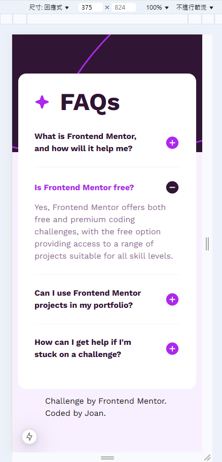
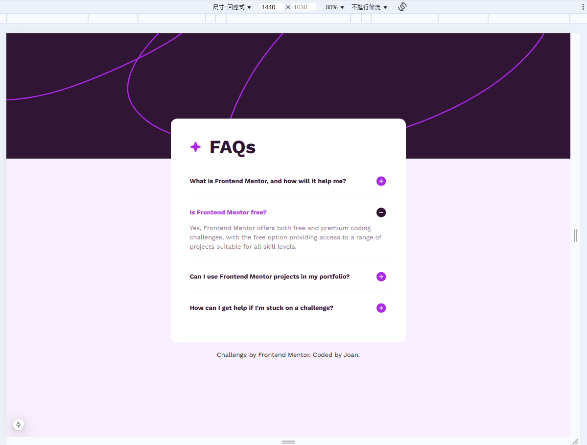

# Frontend Mentor - FAQ accordion solution

This is a solution to the [FAQ accordion challenge on Frontend Mentor](https://www.frontendmentor.io/challenges/faq-accordion-wyfFdeBwBz). Frontend Mentor challenges help you improve your coding skills by building realistic projects. 

## Table of contents

- [Overview](#overview)
  - [The challenge](#the-challenge)
  - [Screenshot](#screenshot)
  - [Links](#links)
- [My process](#my-process)
  - [Built with](#built-with)
  - [What I learned](#what-i-learned)
  - [Continued development](#continued-development)
  - [Useful resources](#useful-resources)
- [Author](#author)
- [Acknowledgments](#acknowledgments)

## Overview

### The challenge

Users should be able to:

- Hide/Show the answer to a question when the question is clicked
- Navigate the questions and hide/show answers using keyboard navigation alone
- View the optimal layout for the interface depending on their device's screen size
- See hover and focus states for all interactive elements on the page

### Screenshot

### Links

- Solution URL: [github](https://github.com/joanneast/fm-faq-accordion.git)
- Live Site URL: [vercel](https://fm-faq-accordion-mocha.vercel.app/)

## My process

### Built with

- [Next.js](https://nextjs.org/)
- [Tailwind CSS](https://tailwindui.com/)

### What I learned

1 客製字體
2 客製色
3 背景圖片加入形式
4 手風琴列表
5 CSS 轉場（選擇性）

1 custom font
2 custom color
3 add background picture
4 accordion list
5 transition (including filter)

## Author

- Frontend Mentor - [@Joan](https://www.frontendmentor.io/profile/joanneast)
